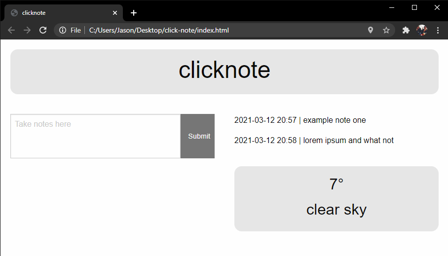

# click-note

## Description

This is a simple note taking application that also features a weather widget displaying the local temperature and weather conditions.

Link to page: [clicknote](https://carson133.github.io/click-note)

https://github.com/Carson133/click-note

## Installation

Type the following into your terminal to copy this repository:

`git clone git@github.com:Carson133/click-note.git`

For further instructions, visit https://help.github.com.

## Usage

Type notes you want to take down in the text box and click the "save" button, they will be saved locally and appear to the right. Click the "x" button to delete notes. The weather widget appears below the saved notes.

## Credits

https://github.com/10-kp

https://github.com/Carson133

https://github.com/twohunters

https://get.foundation/

https://jquery.com/

https://openweathermap.org/

http://worldtimeapi.org/

## License

Licensed under the [MIT](LICENSE) license.

---
